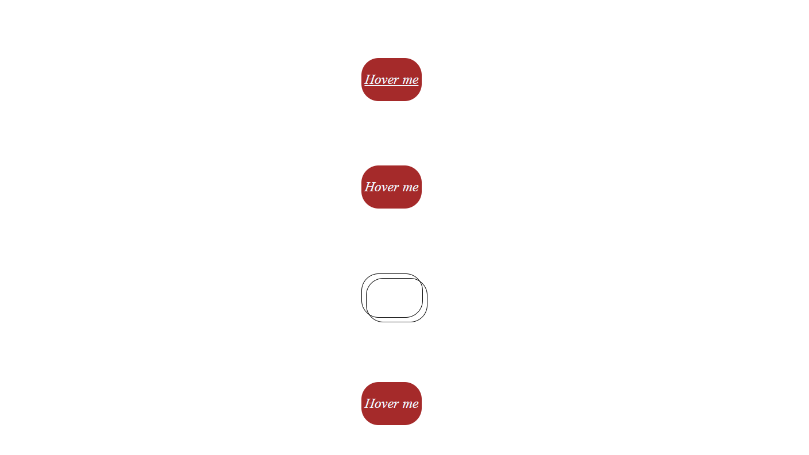

## Hover Effects
Use of basic Css property i.e (:hover) and (::after) to create some fun animations.

## More
- 1.Turns into a circle with a shadow and the text dissolves in back-ground.
- 2.Text color changes, back-ground color changes and generates a box shadow.
- 3.Texts disappear and two box pop out, one in the front and other in the back.
- 4.The whole box disapperas slowly and cursor changes to cross-hair.

## Made using
- **HTML**: Basic skeleton for the divisions.
- **CSS**: To style i.e add colors, depth , transitions and hover-effectts.
- **JavaScript**: Of no use for now. 

## Usage
1. Just normal cloning 
2. Open the folder
3. Checkout the clock on currency.html

## Screenshot

