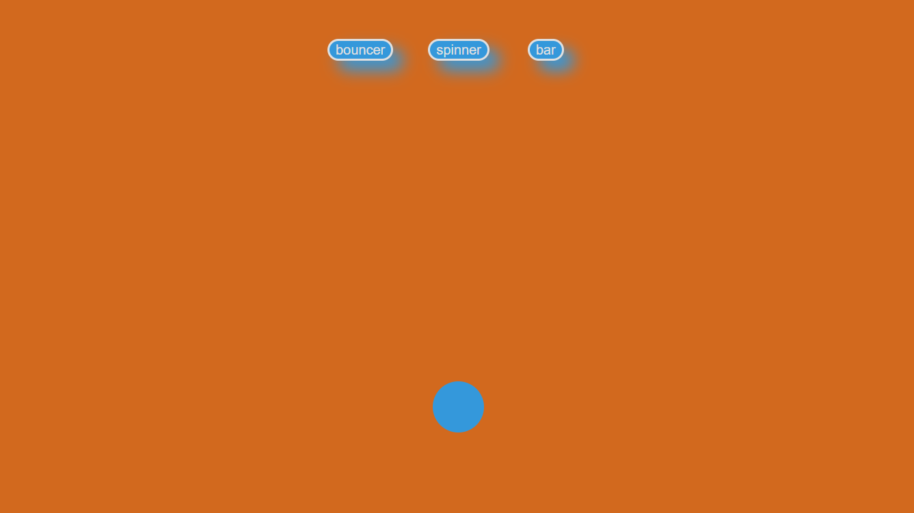
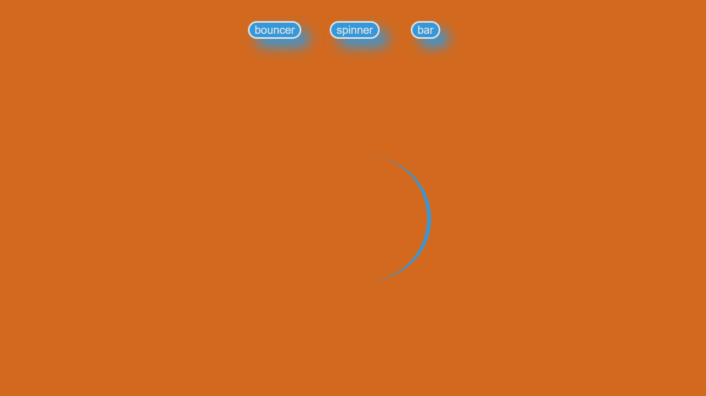

# Loaders
Three basic loader types.

## More
- Displays three types of usable loaders on button-click.
- Includes spinner, bouncer and bar.
- Looks asthetic AF.

## Made using

- **HTML**: Basic skeleton for adding the divisions for loaders.
- **CSS**: To style i.e add colors, depth and animations.
- **JavaScript**: To hide and unhide other loaders when ne is active. 

## Usage

1. Just normal cloning 
2. Open the folder
3. Checkout the loaders on loader.html

## Screenshot

