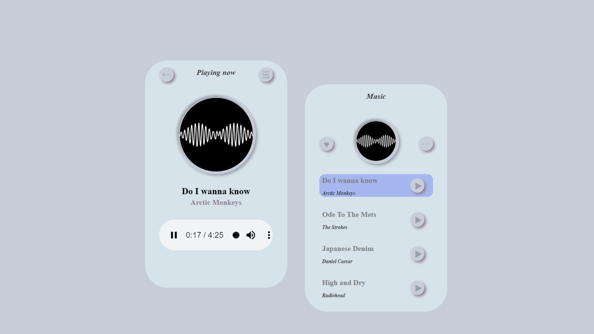

## Music player
A basic HTML+CSS based music player that plays only one song as of now. Javascript will be integrated later when i do this as a mojor project. 

## More
- Plays one song.
- Two windows, one for playing and other for list.
- Good looking and directive hover effects.

## Made using
- **HTML**: Basic skeleton for both the players and their elements.
- **CSS**: To style i.e add colors, depth , transitions and hover-effectts.
- **JavaScript**: Of no use for now(Will be used when i do it major). 

## Usage
1. Just normal cloning 
2. Open the folder
3. Checkout the player on neumorphism.html

## Screenshot

